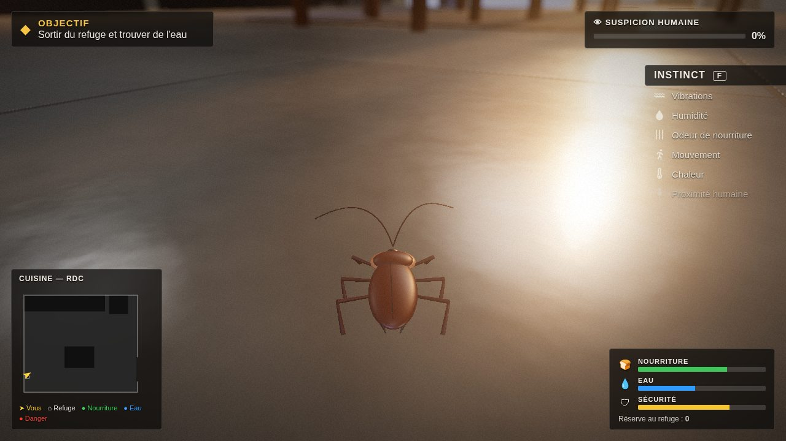
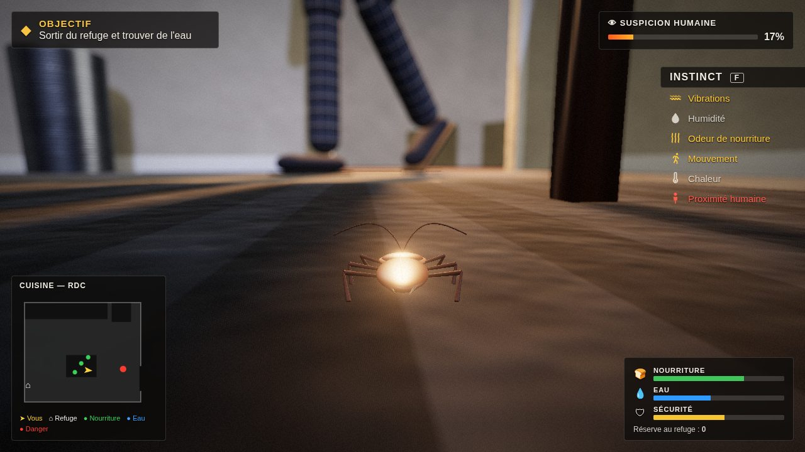

# COCKROACH

Tu es un cafard de 3 cm, dans une cuisine, la nuit. Sors du refuge,
trouve de l'eau et de la nourriture, constitue une réserve… et ne te fais
pas écraser quand l'humain rentre.

**Jouer dans le navigateur :** https://okidoki9903.github.io/COCKROACH/
(une fois GitHub Pages activé, voir plus bas). Chrome ou Edge conseillés,
casque recommandé.

## Le jeu

- **Grimper partout :** sol, murs, façades des meubles, plan de travail,
  table (dessus et dessous), chaises, frigo, plafond. Espace pour se
  laisser tomber ou faire un petit saut.
- **Besoins :** la nourriture et l'eau baissent avec le temps, plus vite
  en marchant et encore plus en sprintant. À zéro, tu t'épuises.
- **Miettes :** à manger sur place, ou à **ramasser** et rapporter au
  refuge pour constituer une **réserve**, que tu peux manger à l'abri.
  L'humain en laisse tomber de nouvelles quand il grignote.
- **Eau :** une petite fuite sous l'évier et des gouttes, qui se
  rechargent lentement.
- **L'humain :** la cuisine est souvent vide. Il vient avec une raison
  (frigo, évier, grignoter à la table), allume la lumière, reste un
  moment, repart. S'il te voit (lumière, mouvement, proximité), sa
  **suspicion** monte. À 100 %, il frappe, pied ou main, avec un
  avertissement : bouge ! Le dessous des meubles, du frigo et le refuge
  protègent ; le plafond est hors de portée.
- **Instinct :** le panneau de droite s'allume selon ce que tu ressens
  (vibrations, humidité, odeur de nourriture, mouvement, chaleur,
  proximité humaine). **F** (ou **Y** à la manette) révèle les odeurs
  proches pendant quelques secondes.
- **Objectifs :** ils s'enchaînent en haut à gauche (boire, manger,
  rapporter, grimper, survivre à une visite, réserve de 3 puis 5…).

## Commandes

| Clavier + souris | Manette (Xbox, 8BitDo en X-input, PlayStation) | Action |
|---|---|---|
| ZQSD (AZERTY) / WASD (QWERTY) | stick gauche ou croix | se déplacer |
| souris | stick droit | regarder |
| molette | LB / LT | zoom |
| Maj | RB / RT | sprint |
| E | A | manger, boire, entrer ou sortir du refuge |
| G | X | ramasser ou poser une miette |
| Espace | B | se laisser tomber / petit saut |
| F | Y | instinct |
| R | Back / Select | **enregistrer une vidéo** (appuyer à nouveau pour arrêter) |
| C | clic du stick droit | photo |
| Échap | Start | pause et réglages |

## Enregistrer et partager (X, etc.)

- **R** démarre l'enregistrement de la partie (image + son), **R** à
  nouveau l'arrête : la vidéo se télécharge.
  - Chrome et Edge : **MP4**, que X accepte directement.
  - Firefox : WebM, à convertir avant X.
- **C** prend une photo PNG.

## Réglages (Échap)

- Qualité **Haute** ou **Basse** : la basse coupe le flou de profondeur
  et le halo et réduit la résolution, pour les PC modestes.
- Sensibilité, volume, inversion de l'axe vertical.

Réglages et record sont gardés dans le navigateur.

## Activer le lien de jeu (GitHub Pages, une fois)

Sur GitHub : **Settings → Pages → Build and deployment → Source :
*Deploy from a branch*** puis **Branch : `claude/cockroach-concept-analysis-39jid0`,
dossier `/ (root)`** → **Save**. Après une ou deux minutes, le jeu est en
ligne à l'adresse ci-dessus.

## Technique

- Three.js 0.186 (licence MIT), copié dans `vendor/three/`. Pas
  d'étape de compilation : des fichiers statiques, servis tels quels.
- **Tout est généré par le code :** textures (carrelage, bois, granit,
  plâtre, tissu), cafard, humain, sons (Web Audio). Aucun fichier sous
  licence tierce.
- Rendu : ombres, flou de profondeur centré sur le cafard, halo,
  vignette. Le décor fixe est fusionné par matériau (environ 370 appels
  de dessin par image, lumière éteinte).

| Fichier | Rôle |
|---|---|
| `index.html`, `src/style.css` | page, écran titre, interface |
| `src/main.js` | rendu, boucle |
| `src/kitchen.js`, `src/textures.js` | cuisine, lumières, objets ; textures procédurales |
| `src/roach.js` | le cafard (corps, 6 pattes en marche tripode, antennes) |
| `src/walker.js` | marche sur toutes les surfaces, caméra qui suit la surface |
| `src/human.js` | l'humain : emploi du temps, perception, frappe |
| `src/game.js` | besoins, objets, refuge, sens, objectifs, pause, mort |
| `src/hud.js`, `src/audio.js`, `src/recorder.js`, `src/input.js` | interface, sons, vidéo, clavier/souris/manette |

**Lancer en local :** `npx http-server -c-1 .` puis
http://localhost:8080. Un serveur est nécessaire ; ouvrir le fichier
directement ne marche pas.

**Tests :** `node tests/smoke.mjs` fait 14 contrôles de comportement dans
Chromium, avec des touches simulées. `node tests/shot.mjs <dossier>
<scenario.json>` produit des captures.

## Ce qui n'est pas encore vérifié

- **Images par seconde sur une vraie carte graphique :** non mesurées.
  Tout a été testé en rendu logiciel, sans GPU.
- **Manette réelle :** non essayée.
- **Son :** jamais écouté par personne.
- Le cafard et l'humain sont des modèles provisoires construits en code.

L'ancien prototype Godot est archivé dans la branche `archive-godot`.
