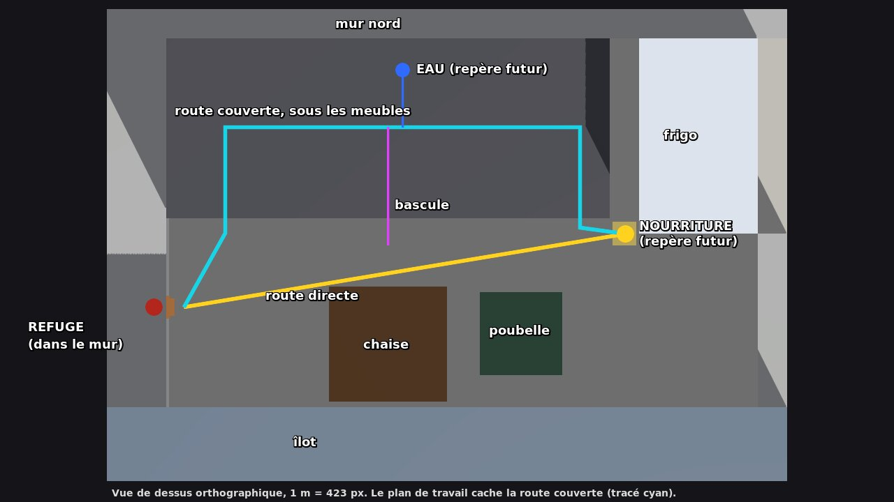

# Blockout de cuisine (tâche E)

Scène : `scenes/levels/kitchen_blockout.tscn`. Elle est écrite par
`tools/gen_kitchen_blockout.py`, un outil de création hors ligne : la
scène est statique et rien n'est généré à l'exécution. Pour modifier le
niveau, on change les nombres dans le script puis on le relance.

Réutilise : `Player`, `CameraRig`, `PlayerInput`, `PauseController`.
Aucun système de ressources, d'humain, de suspicion ni de lumière de
détection. La nourriture et l'eau sont des repères **inertes**.

## Plan vu du dessus



```text
        x=0            x=0.75                 x=1.5  x=1.6       x=2.0
 z=0    ┌────────────────────── mur nord ────────────────────────────┐
        │ · pieds       ~ EAU (0.80, 0.10) + tuyau        · │fente │        │
        │                                                   │10 cm │ FRIGO  │
        │   route couverte (z = 0.30)  ════════════════▶    │      │        │
 z=0.52 │▀▀▀[O]▀▀▀▀▀▀▀▀▀▀▀▀[M]▀▀▀▀▀▀▀▀▀▀▀▀▀▀▀▀▀▀▀[E]▀▀▀│      │        │
 z=0.58 │─────────── façades des meubles bas ───────────────┘      └────────┤ z=0.66
        │  ╲             ║ bascule                  ● NOURRITURE (1.55, 0.66)
        │   ╲            ║                      ╱                          │
 z=0.91 R══ sortie ═════ route directe ═════════                           │
        │  (6 cm)   ┌─ chaise ─┐     ┌ poubelle ┐                          │
        │           └──────────┘     └──────────┘                          │
 z=1.25 │▄▄▄▄▄▄▄▄▄▄▄▄ îlot (retrait de plinthe : abri de 5 cm) ▄▄▄▄▄▄▄▄▄▄▄▄▄│
        └──────────────────────────────────────────────────────────────────┘
 R = refuge dans le mur ouest ; [O] [M] [E] = brèches de 10 cm dans la plinthe
```

Axes : +X vers l'est, +Z vers le sud, 1 unité = 1 m. La face du mur nord
est en z = 0, celle du mur ouest en x = 0.

## Dimensions

| Élément | Position / taille | Rôle |
|---|---|---|
| Sol praticable | x 0 → 2,0 m, z 0 → 1,25 m (≈ 2,0 × 1,25 m) | Agrandi par rapport aux 1,2 × 0,8 m proposés, pour obtenir les temps de parcours visés |
| Refuge | cavité x −0,16 → 0, z 0,84 → 0,98, **6 cm** de haut | Départ ; sol brun sombre, plafond bas |
| Sortie du refuge | ouverture dans la plinthe : **6 × 6 cm** (z 0,88 → 0,94) ; bande orange au seuil | Sortie lisible ; corps de 2 cm de diamètre |
| Repère du refuge | prise murale orange de 8 × 8 cm au-dessus de la sortie | Visible depuis la nourriture |
| Meubles bas | x 0 → 1,5, profondeur 58 cm, dessous à **10 cm** | Couverture de la route couverte |
| Plinthe en retrait | z 0,52, hauteur 10 cm, trois brèches de **10 cm** : x 0,15–0,25 (ouest), 0,70–0,80 (milieu), 1,35–1,45 (est) | Entrées, sortie et bascule |
| Pieds sous meubles | 2 × 2 cm, x 0,03 / 0,50 / 1,00 / 1,46, z 0,04 / 0,48 | Repères et couvertures dans le tunnel |
| Tuyau + repère d'eau | (0,80 ; 0,03), repère bleu en (0,80 ; 0,10) | Détour depuis la route couverte |
| Frigo | x 1,6 → 2,0, z 0 → 0,66 ; fente de 10 cm avec les meubles | Grand repère blanc près de la nourriture |
| Nourriture (repère) | (1,55 ; 0,66) : pastille jaune de 8 cm et fragment de biscuit de 3 cm de haut | Destination visible |
| Chaise | 40 × 40 cm, 4 pieds de 2,5 cm, assise à 45 cm | Couverture 1, le long de la route directe |
| Poubelle | 28 × 28 × 40 cm, centre (1,20 ; 1,00) | Couverture 2 |
| Îlot | façade en z = 1,25, plinthe en retrait en z = 1,30 | Limite sud ; bande couverte de 5 cm |

Largeurs libres minimales sur les trajets prévus (corps : cylindre de 2 cm
de diamètre, visuel de 3 × 1,2 cm) :

| Passage | Largeur libre | Hauteur libre |
|---|---|---|
| Sortie du refuge | 6 cm | 6 cm |
| Brèches de plinthe | 10 cm | 10 cm |
| Sous les meubles | 43 cm entre les rangées de pieds | 10 cm |
| Route directe près du pied avant de la chaise | ≈ 1,3 cm entre la collision et le pied | — |

Aucune fissure obligatoire, aucune marche verticale : tout le sol est à
y = 0.

## Fonction des routes

**Route directe (ouverte).** Elle sort du refuge et traverse l'allée en
diagonale jusqu'au coin du frigo. Le biscuit est visible dès le milieu du
trajet (vue 03). Le cafard est en pleine lumière, loin de tout abri, sauf
en frôlant la chaise puis en passant devant la poubelle. C'est la plus
courte.

**Route couverte.** Elle longe la plinthe du mur ouest jusqu'à la brèche
ouest, file sous les meubles bas (dans la pénombre, entre deux rangées de
pieds) et ressort par la brèche est, à 17 cm de la nourriture. Elle est
50 % plus longue. Les repères du tunnel : la lumière des brèches, les pieds
et le repère d'eau bleu.

**Bascule.** La brèche du milieu relie les deux routes, à hauteur de la
chaise. On peut quitter la route directe pour se mettre à couvert, ou
l'inverse, sans revenir au refuge.

**Couvertures intermédiaires** (propriétés spatiales seulement, pas de
danger simulé) : la chaise (pieds et ombre de l'assise), la poubelle, les
pieds sous les meubles et le retrait sous l'îlot.

## Longueurs et temps mesurés

Mesures du `kitchen_route_runner` : le robot suit des points de passage à
vitesse constante, en tournant sans délai (physique 60 Hz, déterministe).
Les temps vont du point d'apparition jusqu'à l'arrivée.

| Route | Sens | Longueur | Marche (0,08 m/s) | Sprint (0,16 m/s) |
|---|---|---|---|---|
| Directe | aller | 1,60 m | **20,1 s** | 10,1 s |
| Directe | retour | 1,70 m | 21,3 s | 10,7 s |
| Couverte | aller | 2,40 m | **30,1 s** | 15,2 s |
| Couverte | retour | 2,50 m | 31,4 s | 15,8 s |
| Bascule (directe → couverte) | aller | 2,32 m | 29,2 s | 14,7 s |
| Bascule | retour | 2,42 m | 30,4 s | 15,4 s |
| Détour eau (via route couverte) | aller | 1,48 m | 18,6 s | 9,4 s |
| Détour eau | retour | 1,43 m | 18,0 s | 9,1 s |

- La route directe est **33 % plus courte** en temps que la route couverte
  (20,1 contre 30,1 s en marche).
- Les deux sont dans les fourchettes visées (15–25 s et 25–40 s en
  marche). Ce sont des hypothèses de level design, pas des seuils.
- Un joueur réel tourne moins sèchement et hésite : ses temps seront plus
  longs.

## Emplacements réservés

Des `Marker3D` sous `ReservedSpots`, sans script et sans collision :

| Nœud | Position | Pour |
|---|---|---|
| `FutureFood` | (1,5525 ; 0 ; 0,6625) | Nourriture transportable (tâche G) |
| `FutureWater` | (0,80 ; 0 ; 0,095) | Point d'eau (tâche G) |

Points d'apparition (`Spawns`) : `Refuge` (yaw −85°, vers la sortie),
`Nourriture`, `Eau`.

## Éclairage de travail

- Lumière principale venant du sud-est, avec ombres ; lumière d'appoint
  sans ombre ; ambiance à 0,55.
- L'allée est claire. Le dessous des meubles et le refuge restent sombres
  mais lisibles : cafard, pieds et repère d'eau se distinguent (captures
  04 et 07).
- Aucune lumière n'est reliée à un système. `scale_test` n'est pas modifiée.

## Diagnostic

Panneau en haut à gauche, masquable par **F3** (action `toggle_debug`) :
position, vitesse, trajet en cours (temps et longueur), dernier trajet
terminé, et boutons `Refuge`, `Nourriture`, `Eau`. Ces boutons sont un
retour de diagnostic : vitesse à zéro, caméra recalée. Le chronomètre part
à la sortie du refuge (x > 0), s'arrête à 6 cm du repère de nourriture, et
fait de même au retour. Il ne tourne pas en pause.

## Lancer

```sh
G=/chemin/vers/Godot_v4.7.2-stable_linux.x86_64
$G --path . res://scenes/levels/kitchen_blockout.tscn            # jouer (F6 dans l'éditeur)
$G --headless --fixed-fps 60 --path . res://scenes/tests/kitchen_route_runner.tscn   # 52/52
# Captures (rendu nécessaire) :
$G --fixed-fps 60 --path . res://scenes/tests/kitchen_route_runner.tscn -- --overview=/tmp/k
$G --fixed-fps 60 --path . res://scenes/tests/kitchen_route_runner.tscn -- --capture=/tmp/kseq --routes=couverte --modes=marche
python3 tools/gen_kitchen_blockout.py                             # après modification du plan
```

## Vérifications effectuées

| Contrôle | Résultat |
|---|---|
| 4 routes × aller/retour × marche/sprint | 16/16 arrivées ; jamais bloqué ; caméra jamais dans le décor |
| Visuel de 3 cm qui pénètre un obstacle | **0 tick sur 17 972** |
| Raccourci plus court | 33 % plus court en temps |
| Panneau : enregistrement, pause, F3 | OK |
| Non-régression | B 57/57, C 54/54, D 47/47 ; scène principale identique au pixel près |

Captures : `validation/kitchen/plan_annote_4.7.2.jpg` (plan annoté),
`validation/kitchen/vues_4.7.2.jpg` (8 vues à hauteur de cafard, plus une
vue d'ensemble sans l'îlot), `validation/kitchen/sequence_couverte_4.7.2.jpg`
(route couverte, une image toutes les 2 s).

## Observations et limites

- **Défauts corrigés pendant la tâche (lisibilité) :**
  - Depuis la route directe, la nourriture était invisible : repère plat et
    miette de 8 mm. Elle est maintenant représentée par un fragment de
    biscuit de 3 cm.
  - Depuis la nourriture, le refuge était invisible : c'est un trou de 6 cm
    à 1,5 m. Une prise murale orange sert désormais de repère.
- **Rapprochements brusques de la caméra** (immédiats par conception) aux
  virages serrés :
  - sortie du refuge (plinthe), 44–49 mm ;
  - sortie est sous les meubles (joue du meuble), 43 mm ;
  - demi-tour devant le frigo, 67 mm.

  Le robot tourne de 90° en un tick ; à la souris, l'effet sera étalé.
  **Confort à juger.**
- **Tunnel sous les meubles :** 1,2 m en ligne droite, visuellement
  uniforme (captures 0600 à 1440 de la séquence). Il n'y a ni
  rapprochement ni clipping de caméra (10 cm de hauteur libre), mais il
  peut paraître monotone. À juger manuellement avant d'ajouter des repères.
- **Visuel et collision :** aucune pénétration sur les trajets prévus. Le
  visuel peut toutefois entrer dans un mur si le joueur pousse de face
  (dépassement de 5 mm à l'avant, voir `MOVEMENT.md`).
- **Chaise :** la route directe frôle son pied avant, avec 1,3 cm de marge
  pour la collision.
- Le repère du refuge reste petit à 1,5 m (vue 06). À juger à l'écran.
- La traversabilité est prouvée ; la compréhension du niveau et le plaisir
  de jeu **ne sont pas évalués**.
- Rendu logiciel uniquement : aucune mesure de performance.
